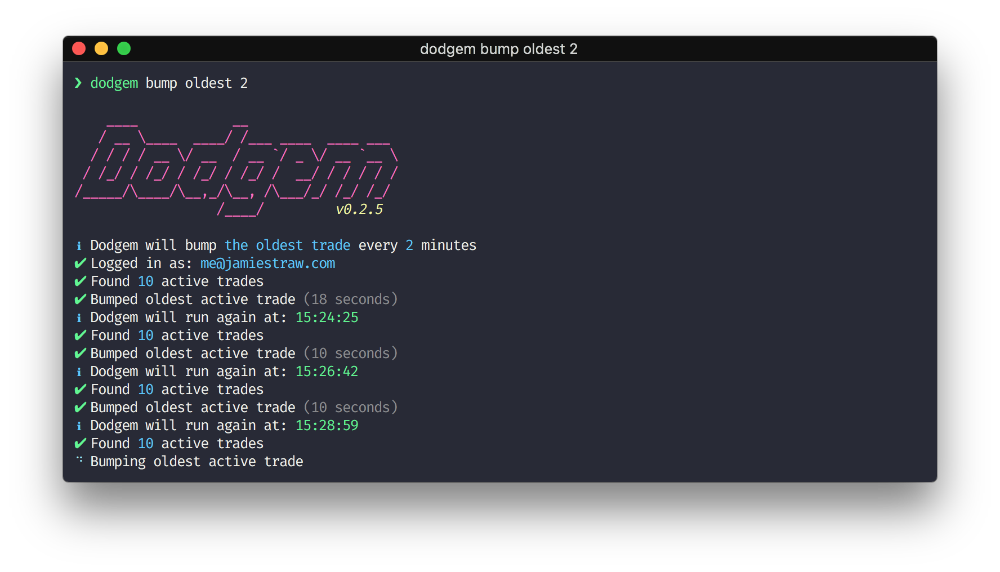
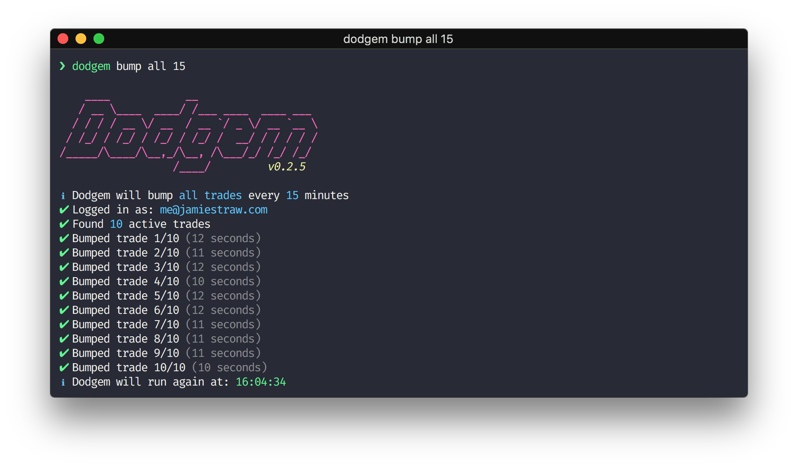

# Dodgem

> 🎪 Rocket League Garage trade bumping automation CLI bot

 [](https://github.com/feross/standard) [](https://www.npmjs.com/package/dodgem) [](https://www.npmjs.com/package/dodgem) [](LICENSE.md)

## 📦 Install

**The minimum version of Node.js required to run Dodgem is `7.6.0`** - ensure that this version (or higher) is installed before installing Dodgem. To check which version of Node.js you have installed you can run: `node -v`.

Dodgem is installed globally via the command line from the npm registry with either [yarn](https://github.com/yarnpkg/yarn) or [npm](https://github.com/npm/npm).

```sh
# Via yarn (recommended)
$ yarn global add dodgem

# Via npm
$ npm install --global dodgem
```

## 🖥 Screenshots




## 🚀 Commands

### `help`

Display detailed usage and help information

### `login`

Set login credentials for Rocket League Garage

*Note: Your login credentials are encrypted and stored locally*

### ` bump <target> <interval>`

Start bumping the specified target every interval

- `<target>` - Which trades to bump - `all` or `oldest`
    - `all` - Bumps all trades - Most effective when you have a variety of different trades
    - `oldest` - Bumps only the oldest trade - Most effective when you have lots of duplicate trades and you want to saturate the market
- `<interval>` - How many minutes to wait before bumping again

###### Examples:

```sh
# Bump all trades every 15 minutes
$ dodgem bump all 15

# Bump the oldest trade every 3 minutes
$ dodgem bump oldest 3
```

## 🔗 Related

[Prosper](https://github.com/jamieweavis/prosper) - 💎 Rocket League Garage trade aggregation & reporting CLI tool

## 📄 License

This project is licensed under the MIT License - see [LICENSE.md](LICENSE.md) for details.

## ⚠️ Disclaimer

The author and any contributors associated with this project are not resposible for the consequences that may occur from the use of this tool.

Users of this tool do so entirely at their own risk - abusing this tool could get you permanently banned from Rocket League Garage.
